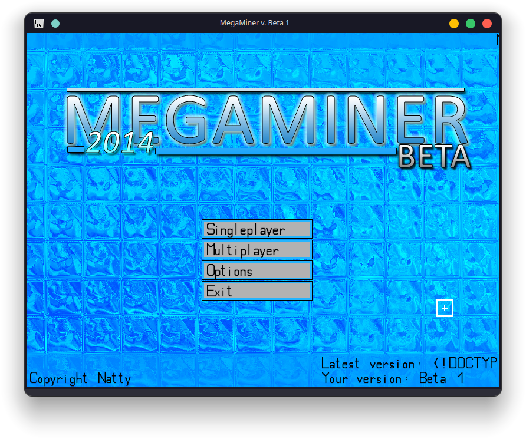

# MegaMiner2014

My first ever game, written in Java. I made it somewhere between
late 2013 and early-to-mid 2014, with some fixes in 2017.

Unfortunately I don't have access to the original machine, so some data
was lost.

The code is terrible, I made minimal changes to it on purpose.



## Dependencies

The game requires JDK 8 and also the following libraries:

* LWJGL 2.9.3
* Slick2D

## Licensing

Please no.

Also, the code probably contains a lot of copy-pasted junk
from random internet forums. I do not advise using any part
of this project. This repository is purely for preservational
purposes.

## Running

I ported all projects to Gradle to make building simpler.

### Client

The game itself. 

```shell
$ JAVA_HOME=path/to/jdk8 ./gradlew :client:run
```

### Server

A game server. Extremely broken and never was finished.

```shell
$ JAVA_HOME=path/to/jdk8 ./gradlew :server:run
```

### Updater

A simple launcher written using the Swing toolkit.

Broken, does not work anymore.

```shell
$ JAVA_HOME=path/to/jdk8 ./gradlew :updater:run
```